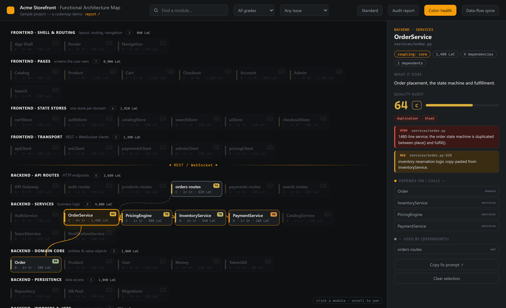
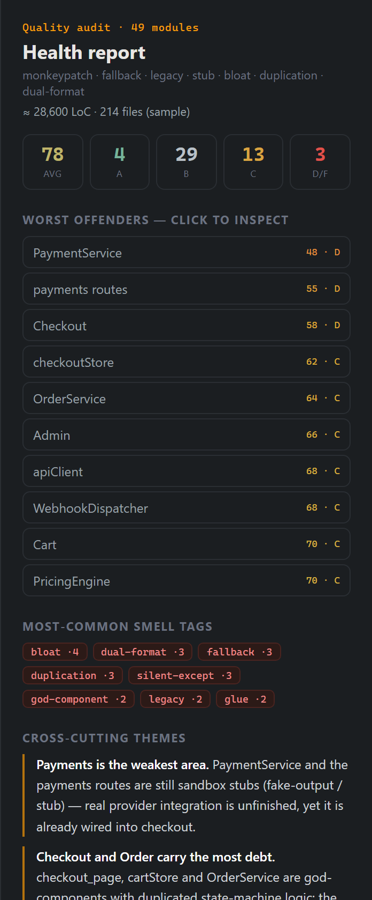

# 🧹 codemap

**A code janitor for AI coding agents.** Point it at any repo and it draws an
**interactive architecture map**, scores **every module 0–100** for technical debt, and
helps you **pay down the cruft** — incrementally, one commit at a time.


> Every codebase accumulates cruft over time — monkeypatches, silent fallbacks, dead
> "legacy" paths, half-finished stubs, copy-pasted duplication, god-files, and valueless
> glue. **codemap surfaces that rot, ranks it, and hands an AI agent a clear punch-list to
> fix it** — with a regression-gated fix loop so the cleanup never breaks your build.


---

## Why codemap

Most "architecture diagram" tools draw *files and imports*. codemap is different:

- **Functional modules, not files.** It groups code into the capabilities that actually
  matter (a store, a handler group, a feature, a plugin) and lays them out along the
  real data-flow.
- **It grades the rot.** Every module gets a health **score (0–100) and grade (A–F)** plus
  concrete `file:line` findings, hunting specifically for the smells that make code
  unmaintainable: `monkeypatch`, `fallback`, `silent-except`, `legacy`/dead code, `stub`,
  `fake-output`, `dual-format`, `bloat`, `duplication`, `glue`, `god-component`, …
- **Independent, honest scoring.** Each module is audited by a **separate AI subagent**
  against a fixed rubric — no single pass rubber-stamping the whole repo.
- **Incremental + git-aware.** A per-module content hash + the last-run commit mean re-runs
  only re-audit what changed, and `update` shows you the **commits since last time** and
  which modules they touched.
- **Cleanup that can't regress.** `fix` runs a four-role loop — lock a test baseline →
  fix → an **independent acceptance check** proves the pre-fix tests still pass → re-score.

It's the maintenance pass you never have time to do, turned into something an agent can
run on a schedule.

## Screenshots

**Click any module** to highlight what it calls (downstream) and what depends on it
(upstream), with its score, smell tags, and `file:line` findings:



The **Audit report** — averages, grade spread, worst offenders, smell-tag frequency, and
cross-cutting themes:



- **Health vs coupling** color modes — problems pop amber/red, healthy modules recede to a
  muted green (colorblind-friendly; the cue is saturation, not just hue).
- **Filter** by grade (≤ B/C/D/F) or by issue tag; jump straight to the worst offenders.
- **Editable Standard page** — change descriptions, **add your own issue tags** to capture
  *your* definition of a problem, and Export to `standard.json`; future audits use it.
- **i18n** — English or Chinese UI (`meta.lang`); module names are never translated.
- **Copy-fix button** on each module — copies `/codemap fix <module>` to paste into your agent.

## Languages

Language-agnostic. LoC and hashing work on **any** text source and `paths` are plain globs,
so it covers **Python, TypeScript/JS, Rust, C#/.NET, C/C++, Go, Java, Swift**, and more.
Build/test/generated trees are excluded out of the box (`target/`, `bin/`, `obj/`,
`node_modules/`, `cmake-build*`, `__pycache__/`, `dist/`, `*.d.ts`, `*.Designer.cs`, …).
The rubric names *behaviors*, not syntax — `reference/STANDARDS.md` maps each smell to its
per-language form (e.g. `any-escape` = `as any` / `dynamic` / `void*` / `reinterpret_cast`
/ `unsafe`).

## Requirements

- **Python 3** — standard library only. No `pip install`, no external packages.
- **An AI coding agent** to drive the audit/fix/test steps: **Claude Code** (native skill)
  or **any agent that reads instructions and spawns sub-tasks**, e.g. OpenAI **Codex**
  (see [Using with Codex](#using-with-codex--other-agents)).
- A browser to open the generated HTML. That's it.

## Install

A Claude Code skill is just a folder under `~/.claude/skills/`:

```bash
git clone https://github.com/Asixa/codemap-skill ~/.claude/skills/codemap
```

(Windows PowerShell: `git clone https://github.com/Asixa/codemap-skill $env:USERPROFILE\.claude\skills\codemap`.)

Restart Claude Code (or start a new session). The skill appears as **`/codemap`**.

## Usage

Talk to Claude in plain language, or use the subcommands. On the first run, codemap asks
your preferences (UI language, output location, project title) and saves them to
`<project>/.codemap/config.json`. Everything it produces lives in `<project>/.codemap/`.

| Command | Does |
|---|---|
| `/codemap generate` | first build: ask prefs → decompose into modules → scan → audit every module → render |
| `/codemap check` | read-only: is the map stale? shows commits since last run + drifted / new / deleted modules |
| `/codemap update` | incremental + git-aware: re-audit only changed modules, re-render |
| `/codemap test <module>` | generate a regression-net of tests for a module |
| `/codemap fix <module>` | regression-gated cleanup: lock baseline → fix → independent acceptance → re-score |

The deterministic scripts (no AI needed) can also be run by hand:

```bash
S=~/.claude/skills/codemap
# what changed since last run — a `git` block lists commits + affected modules
python3 $S/scripts/scan.py  --root . --state .codemap/modules.json
# cache the current HEAD as the new baseline (end of an update)
python3 $S/scripts/scan.py  --root . --state .codemap/modules.json --stamp-rev
# pick targets cheaply, without reading the whole state (for agents)
python3 $S/scripts/query.py --state .codemap/modules.json --max-grade C --format ids
python3 $S/scripts/query.py --state .codemap/modules.json --tag dual-format
# regenerate the HTML + report from the state
python3 $S/scripts/render.py --state .codemap/modules.json --template $S/assets/template.html \
  --out-html .codemap/codemap.html --out-md .codemap/codemap.md
```

> On Windows use `python` instead of `python3`.

## Using with Codex / other agents

The skill mechanism is Claude-specific, but the **engine is tool-agnostic** — four
deterministic stdlib-Python scripts plus a Markdown workflow and rubric. **OpenAI Codex**
auto-reads the shipped **`AGENTS.md`**. To use codemap from Codex (or Cursor, Aider, …):

1. Clone this repo somewhere the agent can read, e.g. `git clone <url> ~/.codemap`.
2. Tell the agent: *"Use the codemap tool at `<path>` to map/audit this project — follow
   its `SKILL.md`; score each module with a separate sub-task per `reference/STANDARDS.md`."*
3. It runs the same `scan → audit → apply_audit → render` loop, using `query.py` to target.

## How it works

```
modules.json  ──scan.py──▶  + LoC, content hash & git diff (stale = hash != auditedHash)
     │                       (decomposition + module descriptions: authored by the agent)
     │◀─apply_audit.py──   one INDEPENDENT subagent's score per module (fixed rubric)
     │◀─query.py──────────  token-cheap targeting (by grade / tag / severity / staleness)
     └──render.py────────▶  codemap.html + codemap.md
```

`modules.json` is the source of truth (commit it for an audit history); the HTML/MD are
pure projections, regenerated by `render.py`. **Four separate subagent roles, never
merged:** *auditor* (scores), *test-author* (writes tests), *fixer* (changes code),
*acceptance/verifier* (proves no regression). Tests are the regression net and are kept
out of a module's own audit scope.

## Customizing the standard (define your own code smells)

The scoring standard is **data, not code** (`reference/standard.json`: rubric, severities,
coupling, and issue tags with descriptions). Open the **Standard** page in the map → **Edit**
→ tweak descriptions, **add your own tags**, then **Export** to
`<project>/.codemap/standard.json`. Custom tags flow through the whole map and are used by
future audits. The prose version + the exact subagent prompt live in `reference/STANDARDS.md`.

## Repository layout

```
codemap/
  SKILL.md          # the orchestration the agent reads
  AGENTS.md         # entry point for Codex / other agents
  README.md
  LICENSE           # MIT
  reference/
    STANDARDS.md    # scoring rubric, smell taxonomy, severities, subagent prompts
    DATA_MODEL.md   # modules.json schema
    standard.json   # the machine-readable default standard (overridable per project)
  scripts/          # deterministic, stdlib-only Python
    scan.py         # LoC + content hash + git diff + staleness
    query.py        # filter modules (grade/tag/severity/…) → ids/paths/findings
    apply_audit.py  # merge one subagent's audit into the state
    render.py       # modules.json → HTML + report
  assets/
    template.html   # the interactive map shell (data injected at render time)
  examples/         # the screenshots above
```

## License

[MIT](LICENSE) © 2026 Xingyu Chen.

---

<sub>Keywords: code quality · technical debt · refactoring · code janitor · legacy code
cleanup · architecture visualization · dependency graph · static analysis · code audit ·
Claude Code skill · Codex · AI agents · code rot · cruft · code smells.</sub>
